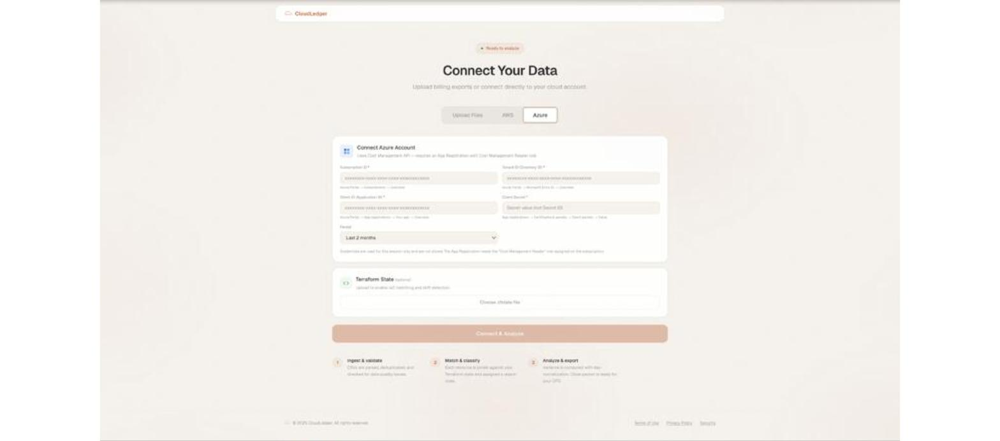
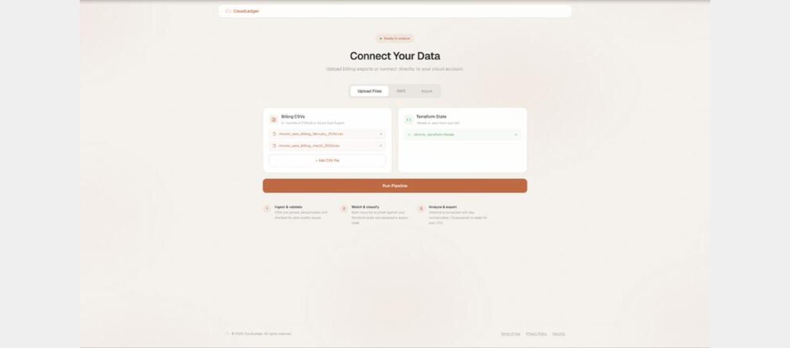
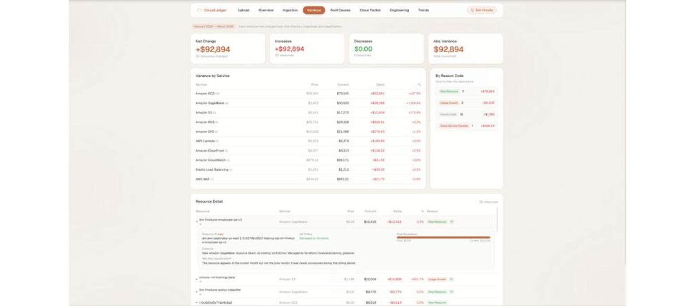
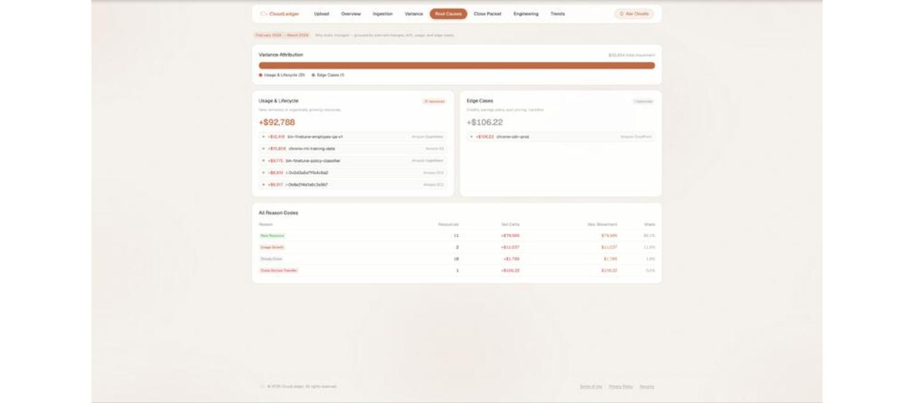
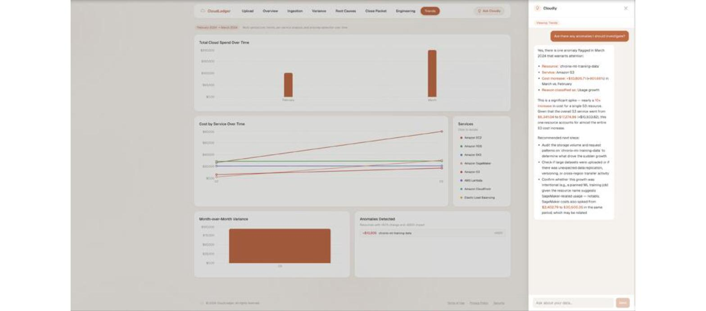

# CloudLedger

**Every month, cloud bills change and nobody can explain why.** CloudLedger traces each dollar of variance to a specific engineering decision — so the month-end close takes minutes, not days.

[](https://github.com/ArnavDasoju/cloudledger/actions/workflows/ci.yml)    

<!-- [SCREENSHOT: Replace with a GIF or screenshot of the Overview + Variance screens] -->

<!-- [LIVE DEMO: Replace with URL if deployed, or delete this line] -->

---

## How It Works

1. **Ingest** billing CSVs (AWS FOCUS 1.2 / Azure Cost Export) or pull directly from your AWS or Azure account
2. **Match** every billed resource against your IaC state (Terraform, ARM, CloudFormation, or Pulumi)
3. **Classify** each cost change into one of 16 reason codes with a structured evidence chain
4. **Day-normalize** variance to eliminate false positives from different month lengths (Feb 28 vs Mar 31)
5. **Generate** a close packet with executive summary, action items, PDF export, and GL journal entry CSV

---

## AI and Data Engineering

### RAG Pipeline + Agentic Tool-Use (Cloudly)

The embedded assistant combines a **retrieval-augmented generation pipeline** over a domain knowledge base with **agentic tool-use** for live billing data:

**RAG pipeline** (`backend/rag.py`):
- 8 markdown documents (variance engine logic, architecture, glossary, screen navigation) chunked into 800-char windows with 100-char overlap, preserving section headers as metadata
- Indexed into a **ChromaDB** persistent vector store using **local Sentence Transformer embeddings** (all-MiniLM-L6-v2) — no external embedding API
- Retrieval applies a cosine distance threshold (1.2), over-fetches by 3, and deduplicates chunks sharing >50% word overlap
- Auto-ingests on server startup if the vector store is empty

**Agentic tool-use loop** (`backend/agent.py`):
1. Retrieved docs are injected into Claude's system prompt as numbered references
2. Claude also receives the user's current screen data and 5 database tools
3. If Claude needs live billing data, it calls a tool — up to 3 rounds before returning a final answer
4. Answers cite both document sources (`[1]`, `[2]`) and tool results

The 5 agent tools (`backend/tools.py`): `query_spend_by_service`, `query_top_variance`, `query_resources_by_filter`, `query_drift_summary`, `query_cost_trend` — each executes SQL against PostgreSQL and returns formatted results.

**Eval harness** (`backend/evaluate.py`): Runs an eval set through the full pipeline and scores faithfulness, correctness, and retrieval quality using Claude as an LLM judge (1–5 scale on each dimension).

### AI Narrative and Cost Forecast

- **Narrative generation** (`/api/narrative`) — Claude generates a CFO-ready variance summary from close packet data
- **Cost forecasting** (`/api/forecast`) — projects total and per-service costs based on historical trends
- **Anomaly detection** (`/api/anomalies`) — flags resources with >50% change and >$500 impact

### Data Pipeline (dbt + Airflow + Snowflake)

- **dbt models** (`dbt_project/`) — staging, intermediate, and mart layers: `stg_billing_lines`, `stg_resources`, `int_invoice_totals`, `int_monthly_resource_spend`, `dim_resources`, `fct_variance_report`
- **Airflow DAG** (`airflow/dags/cloudledger_pipeline.py`) — orchestrates the ingestion-to-variance pipeline
- **Snowflake sync** — pushes billing data to Snowflake and exposes overview, variance, trends, and engineering views via dedicated API endpoints

---

## Variance Engine

- **16 reason codes** classified by a rule-based engine:
  - **Planned**: `planned` (IaC-managed + matching PR)
  - **Drift/unmanaged**: `orphan_sdk_created`, `orphan_unknown`, `legacy_untracked`, `non_terraform_iac`
  - **Organic**: `usage_growth`, `new_resource`, `removed_resource`, `price_change`, `steady_state`
  - **Edge cases**: `savings_plan_allocation`, `ri_coverage_shift`, `credit_applied`, `marketplace_subscription`, `spot_price_volatility`, `cross_service_transfer`
- **Day-normalized comparison** — adjusts prior-month cost by the ratio of days (e.g. 31/28) before computing delta
- **Evidence chains** — every classification includes a structured JSONB audit trail with classification steps, inputs, and human-readable explanation
- **Confidence scores** — 0.50–0.95 based on IaC status, tag coverage, and edge-case detection

---

## Key Features

### Multi-IaC Support
- Terraform (`.tfstate`) — full resource matching with module attribution
- ARM Templates (Azure) — JSON parsing with name-based fuzzy matching
- CloudFormation — logical ID and resource property extraction
- Pulumi — state file parsing with ARN cross-referencing

### Cloud Account Connection
- **AWS**: Access Key + Secret Key, pulls from Cost Explorer API (2–12 months)
- **Azure**: Service Principal credentials, pulls from Cost Management API (2–12 months)

### GitHub CI/CD Integration
- Syncs merged PRs that touch `.tf` files
- Links infrastructure changes to specific cost impacts
- Reclassifies "drift" to "planned" when a matching PR is found

### MCP Server
- Exposes 6 tools for any MCP-compatible client: `get_billing_overview`, `get_variance_by_resource`, `get_root_cause_summary`, `get_iac_coverage`, `get_available_periods`, `get_anomalies`
- Query billing data, variance, IaC coverage, and anomalies programmatically

### Authentication
- JWT-based multi-tenant auth with per-user data isolation
- All billing data, variance reports, and resources are scoped to the authenticated user

---

## Screens

| Screen | Purpose |
|--------|---------|
| **Upload** | Upload billing CSVs or connect AWS/Azure accounts |
| **Overview** | Month-over-month spend comparison with service breakdown |
| **Ingestion** | Data quality checks, Terraform match rate, tag coverage |
| **Variance** | Resource-level detail with reason codes and evidence |
| **Root Causes** | Variance bucketed by planned, drift, usage, and edge cases |
| **Close Packet** | CFO-ready summary, action items, PDF/CSV export |
| **Engineering** | IaC coverage, team attribution, drift inventory |
| **Trends** | Historical charts, per-service trends, anomaly detection |







---

## Getting Started

### Prerequisites

- Python 3.12+
- Node.js 18+
- PostgreSQL 14+

### Installation

```bash
git clone https://github.com/ArnavDasoju/cloudledger.git
cd cloudledger

# Python
python3 -m venv venv
source venv/bin/activate
pip install -r requirements.txt

# Frontend
cd frontend
npm install
cd ..

# Database
createdb cloudledger

# Environment
cp .env.example .env
# Edit .env with your database credentials and ANTHROPIC_API_KEY
```

### Running

```bash
# Terminal 1: Backend
source venv/bin/activate
python -m uvicorn backend.server:app --host 0.0.0.0 --port 8000

# Terminal 2: Frontend
cd frontend
npm run dev
```

Open [http://localhost:3000](http://localhost:3000)

### Running Tests

```bash
source venv/bin/activate
pytest tests/ -v
```

### Using the MCP Server

Add to your MCP client config (e.g. `~/Library/Application Support/Claude/claude_desktop_config.json`):

```json
{
  "mcpServers": {
    "cloudledger": {
      "command": "/path/to/cloudledger/venv/bin/python",
      "args": ["-m", "cloudledger.mcp_server"]
    }
  }
}
```

---

## Architecture

```
                        +------------------+
                        |    Next.js 16    |
                        |    Frontend      |
                        +--------+---------+
                                 |
                        +--------v---------+
                        |    FastAPI        |
                        |    (32 endpoints) |
                        +--+-----+------+--+
                           |     |      |
              +------------+  +--+--+  ++----------+
              |               |     |              |
     +--------v------+  +----v--+ +v-------+ +----v------+
     | Claude Agent   |  |GitHub| | MCP    | | Snowflake |
     | (RAG + Tools)  |  | API  | | Server | | Sync      |
     +--------+-------+  +------+ +--------+ +-----------+
              |
     +--------v-------+
     | ChromaDB       |
     | (Vector Store) |
     +----------------+

     +------------------+     +------------------+
     |   PostgreSQL     |     |   dbt Models     |
     |   (Primary DB)   |     |   (Analytics)    |
     +------------------+     +------------------+
```

**Backend** (`backend/server.py`) — FastAPI with 32 endpoints for auth, data ingestion, variance analysis, trends, chat, cloud account connection, Snowflake sync, forecasting, and anomaly detection.

**Analysis Engine** (`cloudledger/`) — Python modules for CSV ingestion, IaC state parsing (Terraform/ARM/CloudFormation/Pulumi), resource normalization, day-normalized variance computation, and 16-code reason classification.

**AI Layer** (`backend/agent.py`, `backend/rag.py`, `backend/tools.py`) — Agentic RAG: ChromaDB retrieval + 5 database tools + Claude tool-use loop. Eval harness with LLM-as-judge scoring.

**Frontend** (`frontend/`) — Next.js 16 / React 19 single-page app with 8 screens, interactive charts (Recharts), and the Cloudly chat panel.

**Data Pipeline** (`dbt_project/`, `airflow/`) — dbt models for staging/intermediate/mart layers; Airflow DAG for pipeline orchestration.

---

## Tech Stack

| Layer | Technology |
|-------|-----------|
| Frontend | Next.js 16, React 19, Tailwind CSS, Recharts |
| Backend | FastAPI, SQLAlchemy, Pydantic |
| Database | PostgreSQL |
| AI / LLM | Anthropic Claude (chat agent, narrative, eval judge) |
| RAG | ChromaDB (vector store + default embedder) |
| Cloud SDKs | boto3 (AWS), Azure REST API |
| IaC Parsing | Terraform, ARM, CloudFormation, Pulumi |
| Data Pipeline | dbt, Apache Airflow, Snowflake |
| Protocol | MCP (Model Context Protocol) |
| Auth | JWT (PyJWT + bcrypt) |

---

## License

[MIT](LICENSE)
